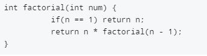
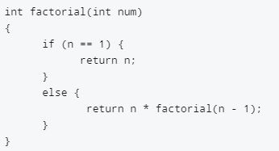

Creating clean looking code is a vital, and sometimes overlooked, aspect of software engineering. Making sure that the programs you write are neat and structured can be beneficial for debugging and make it easier to get input from colleagues. This is especially important if you are learning or new to a language. Luckily there are tools and methods that assist in this endeavor. The first of which are coding standards. 

## Coding Standards 

A coding standard gives a uniform appearance to the codes written by different engineers. It improves readability, and maintainability of the code and it reduces complexity.

 When learning a new language, studying code that is organized and follows some sort of coding standards helps a lot. Reading, understanding, and comprehending what each line does becomes much easier because the program does not look like a jumbled mess. It has structure. I think this applies to both experienced software engineers learning a new language and newbie coders learning to program for the first time. 
As someone who is currently learning Javascript through this class, I can attest to coding standards being beneficial to the process. For example, writing classes in Javascript is different from C++, but they are both structured so similarly in terms of indentation and spacing that it is super easy to pick up.
An example of coding standards in use can be seen in the graphic below. On the left is a function written without any coding standards. As a result it is much more squished together and harder to read. On the right, the same function can be seen, but this time written using specified and consistent spacing parameters. This code is much more pleasing to the eye and is easier to read as a result. 

  
  

## ESLint and Intellij

Another useful tool for producing cleaner code is ESLint. After a week of using ESLint with Intellij, I find ESLint to be useful and Intelij to be a good editor. That being said, I’m not accustomed to using a tool like ESLint. At times, the red lines lead me to believe I made a fatal error in my code when I really just didn’t space something out properly. This can be slightly problematic when doing a time sensitive task such as WODs. However, I think ESLint is an overall positive addition to our toolbox as software engineers. 
