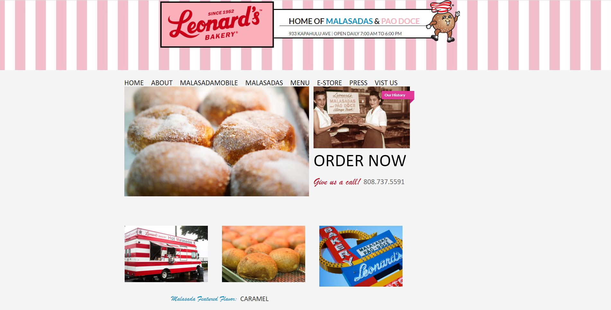
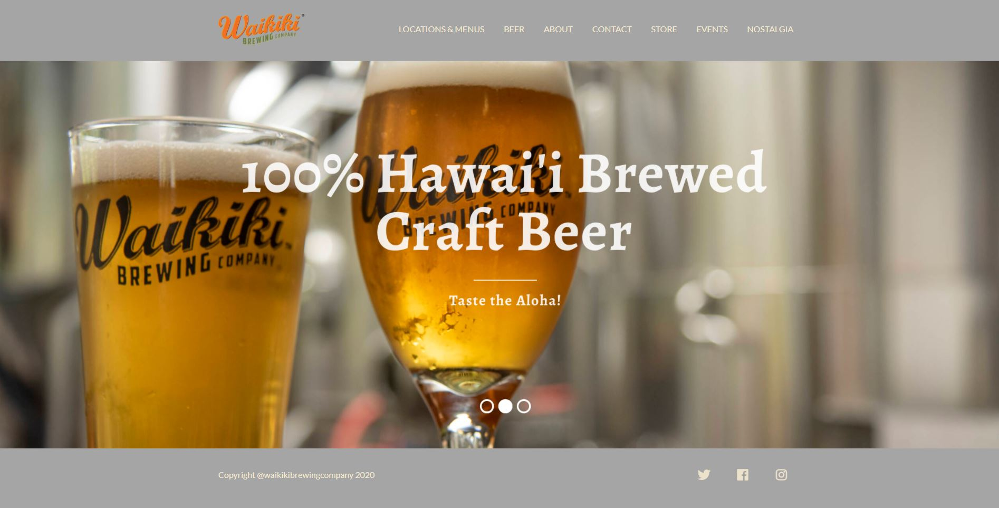

## Evolution of Buissness 
In recent years, the demand for small businesses and online services has been growing exponentially. The onset of a global pandemic has only strengthened that need. As big name retailers shut their doors to adhere to quarantine policies, small businesses that operate on the web as opposed to a physical store are becoming more prominent. As entrepreneurs move to the virtual scape, they will require more tech savvy software engineers to design their websites. Therefore, knowledge of user-interface(UI) framework will be a vital skill for new programmers entering the workforce.

## What is Semantic UI?
A UI framework is the set of classes and interfaces that define the elements and behavior of a window-based UI Subsystem. It defines a structure for defining user interfaces. An example of a useful UI Framework is Semantic UI. Semantic UI is a modern front-end development framework, powered by LESS and jQuery. It has a sleek, subtle, and flat design look that provides a lightweight user experience. The first pre-release of Semantic UI surfaced on Github back in 2013. Since then it has become the 4th best CSS frameworks in 2020 becoming known for its simplicity and beginner friendly interface.

## Learning Semantic UI
The easy-to-use quality of Semantic Ui makes it a great learning tool for students. Over the past week our ICS 314 class has learned the basics of Semantic and have used what we learned to complete several in class and homework exercises. Through these assignments we have replicated the websites of several local businesses which can be seen below. In just a few days we have had the chance to explore the limits of Semantic and different web design techniques. By the end of this course, the knowledge we gain of Semantic will not only make us more versatile software engineers but incredibly more prepared to join the COVID impacted workforce.  

