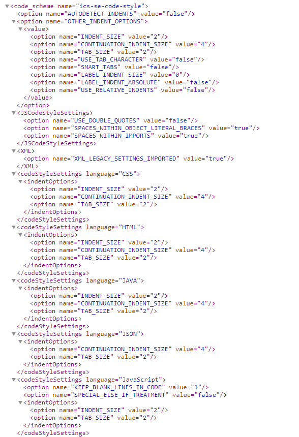

During my time studying web development, I acquired many useful skills and knowledge of tools that software engineers use to produce high quality web applications. 
For example, I now know how to navigate development environments like IntelliJ IDEA and keep my code organized and readable by following a seat of coding standards. 
While invaluable to web development, these skills can easily be applied to any type of programming project I work on in the future.

### Development Enviorments
An integrated development environment (IDE) is a software application that provides comprehensive facilities to computer programmers for software development. An IDE 
normally consists of at least a source code editor, build automation tools and a debugger. IDEs like IntelliJ IDEA are a great tool for programming projects, especially 
if using it in conjunction with Github Desktop. This allows you to make changes to your repository in an editor with an interface that is much for user friendly in 
comparison to the Github browser page. Certain IDEs also allow for the use of analysis tools like ESLint to ensure that the code you are writing is neat and meets your 
predefined coding standards. 

### Coding Standards
Coding standards are a set of guidelines, best practices, programming styles and conventions that developers adhere to when writing source code for a project. 
These guidelines standardize things like when and how much to indent lines, how much to space out certain characters, and when to make a new line. All big software 
companies have their own coding standards so it is an important tool to have experience with. This is also important for any group programming project, as it makes 
it easier for others to read and understand any code you write. In an academic setting, having a set coding standard for the class makes peer review easier. 
It also makes getting assistance for professors or T.A.s a much simpler process. Coding standards can be save in a XML file to be used in an IDE. An example of this is shown below.

