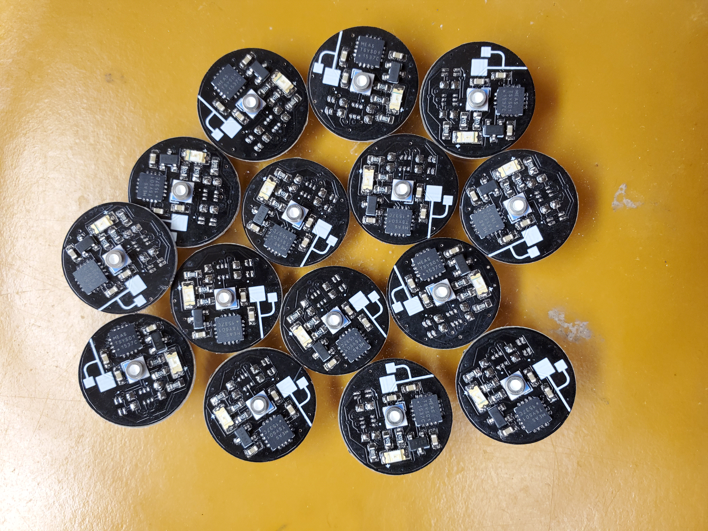
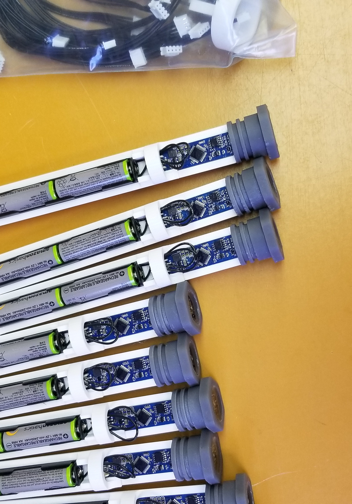
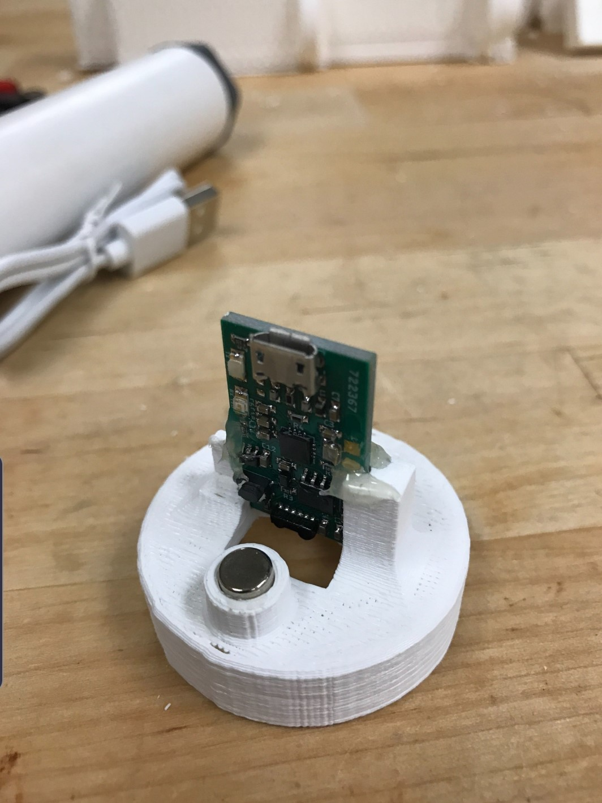

I am responsible for the fabrication of cost effective electronic sensor systems that are utilized to study different marine environments with a focus on Ala Wai Canal and coral reefs. These devices gather temperature, pressure, and light color data which is transmitted through IR communication. To ensure the sensors are safe to deploy they are enclosed within pressurized containers rated for depths up to 300 ft. 

  
  
  

A portion of the sensors built in the lab are distributed to local schools who integrate them into their various STEM curriculum. As an engineering assistant, I need be diligent with a high attention to detail and capable of troubleshooting a variety of issues relating to hardware and software. The devices I build change regularly, so I also need to be able to learn and adapt quickly.

You can learn more at the [Lab's website](https://www.soest.hawaii.edu/oceanography/glazer/Brian_T._Glazer/Research.html).

