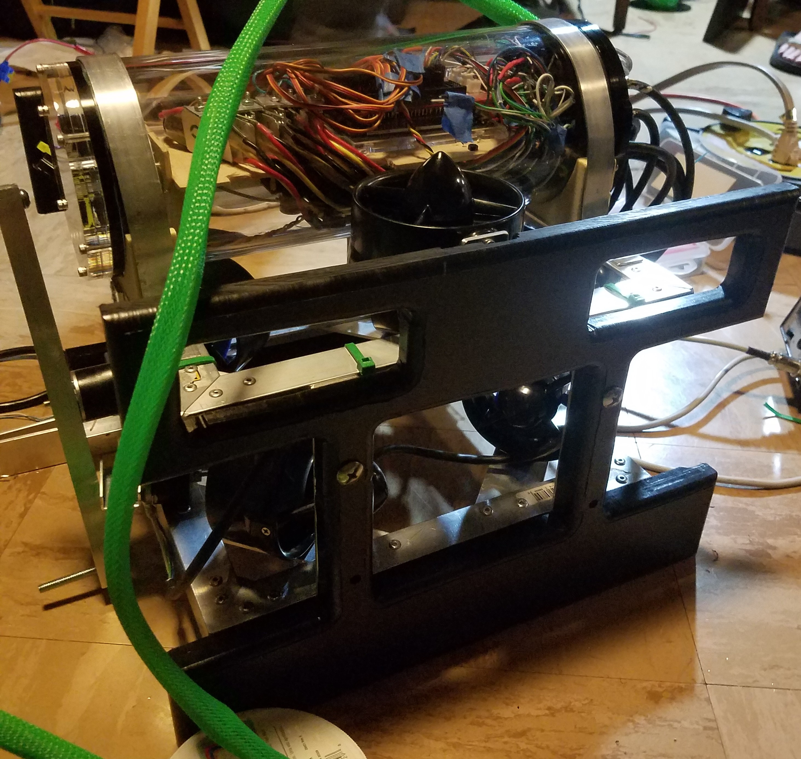

I was in charge of the software implemented on several underwater remotely operated vehicles(ROVs) used in the Marine Advanced Technology Education([MATE](https://materovcompetition.org/)) competition. 

MATE tasks teams of students to construct an ROV capable of completing several simulated missions such as repairing an underwater pipeline, debris retrieval, and taking measurements in water just above freezing temperature. As Lead Software Engineer I wrote C code that managed propulsion, sensor data collection, and data transmission through a serial communication protocol. I was also responsible for building the on-board circuitry located in the ROV's pressurized housing.

In 2017, my team and I placed 1st in the robot performence catagory 2nd overall at the international competition.
 
For technical documentation of our winning ROV click [here](https://files.materovcompetition.org/TechReportArchives/2017/HighlandsInterandPCHS_KaimanaEnter_TechReport_2017.pdf).
