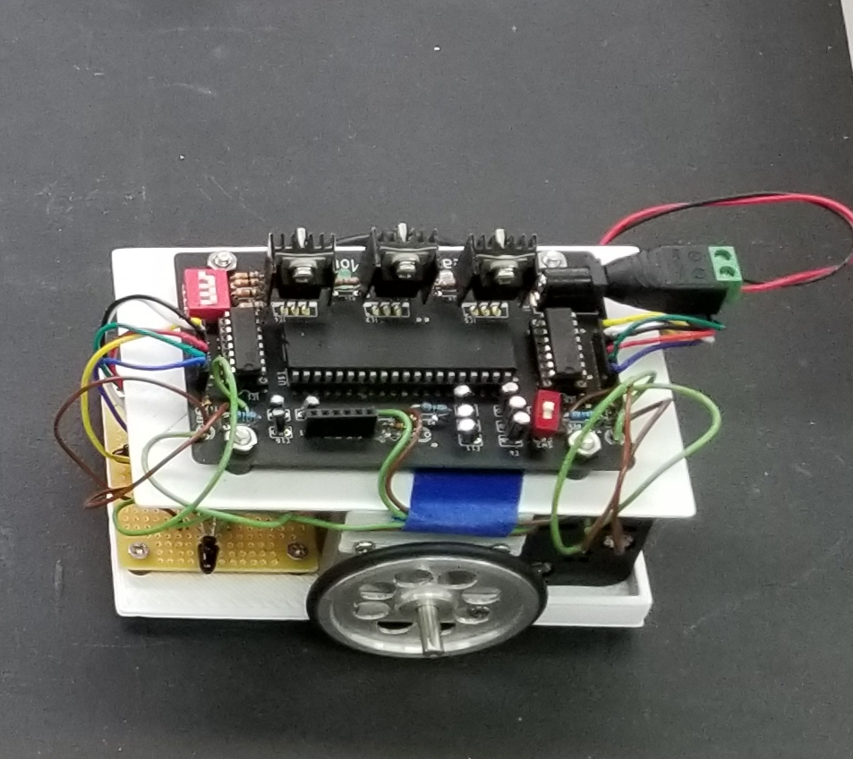
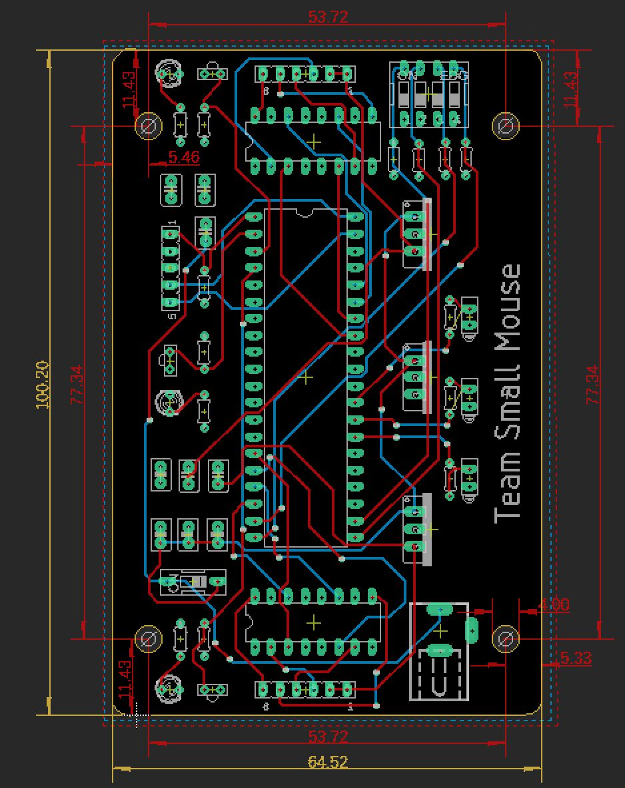
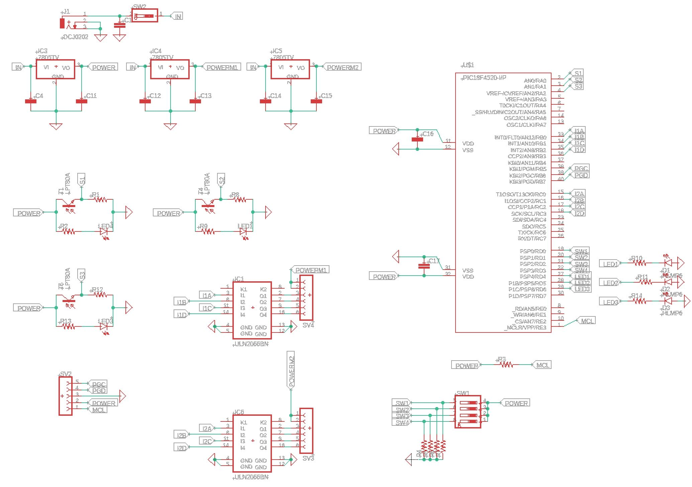

Micromouse is a robotics competition where teams of students spend several months designing, constructing and testing an autonomous vehicle using a five hundred dollar budget. On the day of the competition the robot had to be able to navigate a maze and locate the center as quickly as possible. As Lead Electrical Engineer of the team, I oversaw the production of the electronics system. 

  
  

  

This meant I was responsible for designing a circuit board capable of interfacing with a micro-controller, several sensors and the robot's drive system. In addition I had to find an appropriate power source for the entire system. Given my leadership position, I also had to communicate the progress and setbacks of my portion of the project, as well as accommodate for the progress and setbacks of others. My team and I competed at UH Manoa's intraschool tournament as part of our sophmore project where we placed 1st.

For more information about Micromouse vist this [websie](http://www.micromouseonline.com/).
