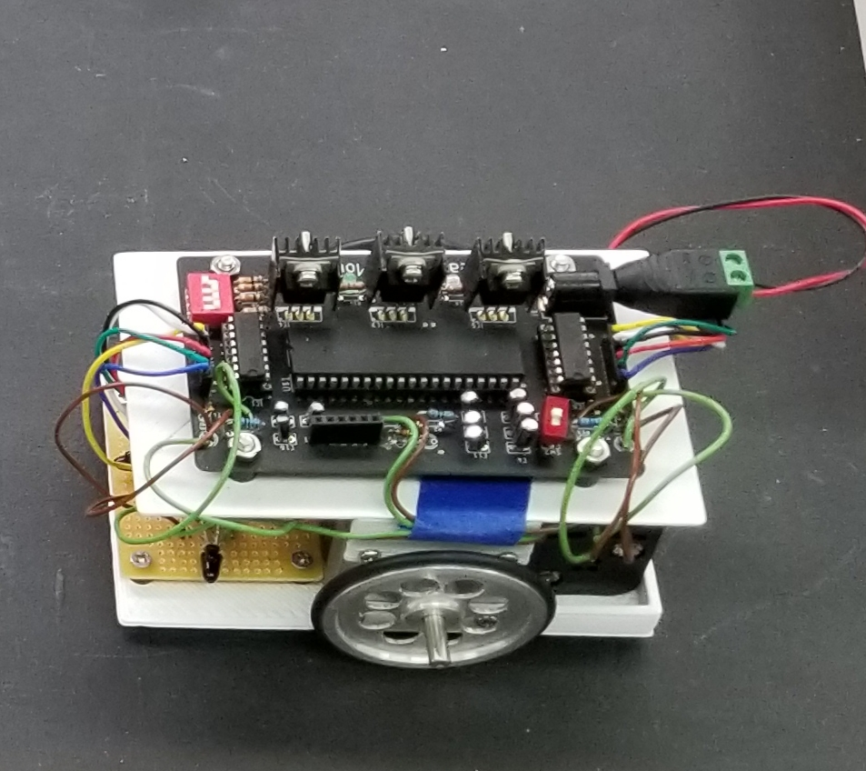
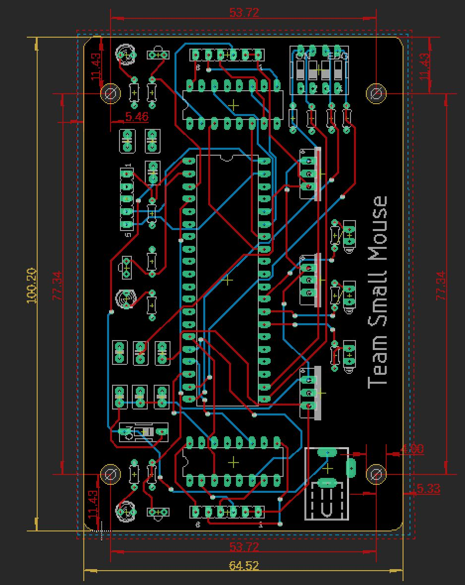

Micromouse is a robotics competition where teams of students spend several months designing, constructing and testing an autonomous vehicle using a five hundred dollar budget. On the day of the competition the robot had to be able to navigate a maze and locate the center as quickly as possible. As Lead Electrical Engineer of the team, I oversaw the production of the electronics system. Our robot used two DC motors for its drive and IR sensors to detect proximity to maze walls. The chassis was designe to be as compact as possible. The electronics were also broken up onto two different circuit boards to help further size reduction.

  
  

  

This meant I was responsible for designing a circuit board capable of interfacing with a micro-controller, several sensors and the robot's drive system. In addition I had to find an appropriate power source for the entire system. Given my leadership position, I also had to communicate the progress and setbacks of my portion of the project, as well as accommodate for the progress and setbacks of others. 

After the robot's electronics were completed I assistad my teammate in creating the maze solving algorithm. While developing the code we were constantly testing the robots performence both in and out of the maze. This resulted in us discovering problems with the hardware and electrical system. I was in charge of troublshooting in these areas and makeing any necessary repairs.

My team and I competed at UH Manoa's intraschool tournament as part of our sophmore project where we placed 1st.

For more information about Micromouse vist this [website](http://www.micromouseonline.com/).
