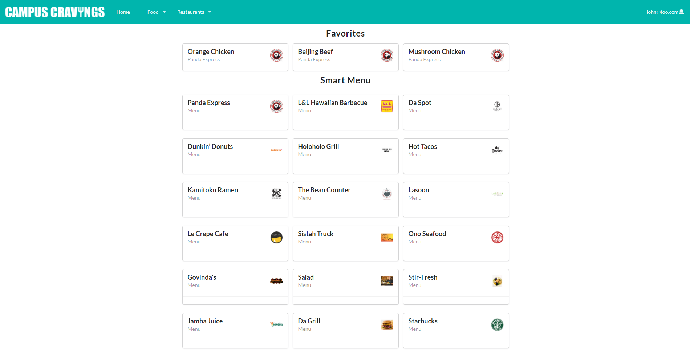

Since University of Hawaii at Manoa’s campus has a variety of food vendors, it can be difficult for students and staff to keep up with what’s available. Many of the locations on campus have different choices, depending what they decide to offer on any given day. There is no easy and concise way to track all of these options and their daily menus: Paradise Palms, campus center, food trucks, etc.

The Campus Cravings app aims to solve this problem by providing an up-to-date resource on everything food related at UH Manoa. Our completed product will allow vendors to create online menus detailing when and where certain dishes will be available. Students will be able to view the food available in the moment as well as browse the top picks of the day.

  
  

  

This website was deployed on Digital Ocean and was programmed in Javascript, React for front end development, and Meteor as a web framework. Campus Cravings was a team based project that implemented Agile Project Management techniques, specifically Issue driven project management (IDPM), to accomplish tasks and meet deadlines.

To learn more about this project, visit [campus-cravings.github.io.](https://campus-cravings.github.io/)

